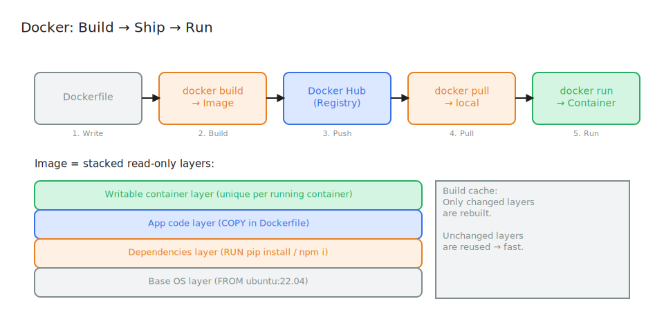

# What is Docker?

## What is it?

Docker is an open-source platform for building, packaging, and running applications in containers. It provides:
- A standardized way to define container images (Dockerfile)
- A runtime to run those containers (Docker Engine)
- A registry to store and share images (Docker Hub)

---

## In Simple Language

Docker lets you take your application and everything it needs to run — code, dependencies, configuration — and wrap it in a portable, self-contained package called a **container image**.

That image can run identically on any machine that has Docker installed. No more "works on my machine."

---

## Real World Analogy

Docker is like a **shipping container system**:

- A **shipping container** (Docker image) is a standardized box that holds goods (your app + dependencies)
- Any **cargo ship** (server with Docker) can carry these containers — the ship doesn't care what's inside
- The **port** (Docker Hub) is where containers are stored and distributed
- **Unloading a container** (running `docker run`) starts your app identically everywhere

Before shipping containers: every ship had custom compartments. Loading took weeks. Fragile and inconsistent.
After shipping containers: standardized boxes. Load anywhere. Ship anywhere.

---

## Why This Exists

**The problem Docker solved:**

Before Docker, deploying an app meant:
1. Manually installing dependencies on the target server
2. Hoping the OS version matched your development machine
3. Wrestling with "dependency hell" — app A needs Python 3.6, app B needs Python 3.9
4. Weeks of setup for new team members

**Docker solved this by:**
- Packaging the app and its dependencies together, isolated from the host
- Using a single `Dockerfile` to describe the entire environment
- Making images reproducible and shareable via registries

---

## How It Works

**Building an image:**
1. Write a `Dockerfile` — a recipe describing your app's environment
2. Run `docker build` — Docker follows the recipe to create an image layer by layer
3. Each instruction in the Dockerfile adds a read-only layer to the image

**Running a container:**
1. Run `docker run <image>` — Docker creates a container from the image
2. A writable layer is added on top of the read-only image layers
3. The container process starts and your app runs
4. Container stops → writable layer is discarded (containers are ephemeral by default)

**Sharing images:**
1. Tag your image: `docker tag my-app:1.0`
2. Push to Docker Hub: `docker push username/my-app:1.0`
3. Anyone can pull and run it: `docker pull username/my-app:1.0`

---

## Visual Diagram



**Image Layers:**
```
┌──────────────────────────────┐
│   Writable Container Layer   │  ← unique to each running container
├──────────────────────────────┤
│   App Code Layer             │  ← your COPY commands
├──────────────────────────────┤
│   Dependencies Layer         │  ← your RUN pip install / npm install
├──────────────────────────────┤
│   Base OS Layer              │  ← FROM ubuntu:22.04
└──────────────────────────────┘
           IMAGE (read-only)
```

**Build → Ship → Run:**
```
[Dockerfile]
     │
     ▼
[docker build] ──► [Image] ──► [Docker Hub] ──► [docker pull]
                                                      │
                                                 [docker run]
                                                      │
                                                 [Container]
```

> **Excalidraw idea:** A factory (your machine) that builds shipping containers (images) from a blueprint (Dockerfile). Containers go to a port/warehouse (Docker Hub). Ships (servers) pick up containers and unload them anywhere in the world.

---

## Key Terminologies

| Term | Technical Definition | Simple Explanation |
|------|---------------------|-------------------|
| **Dockerfile** | A text file with instructions to build an image | A recipe for your app's environment |
| **Image** | An immutable, layered snapshot of a container's filesystem | A sealed blueprint you can stamp out containers from |
| **Container** | A running instance of an image | Your app actually running from the blueprint |
| **Docker Engine** | The daemon that builds and runs containers | The factory floor that makes everything work |
| **Registry** | A storage service for container images | A warehouse where images are stored and shared |
| **Docker Hub** | Docker's public image registry | The public warehouse — free and widely used |
| **Layer** | An incremental filesystem change in an image | One step in the recipe — cached for speed |
| **Tag** | A label on an image (e.g., `myapp:1.0`) | The version sticker on the container |

---

## Common Misconceptions

- **"Docker and Kubernetes are the same thing"** — Docker packages apps into containers. Kubernetes orchestrates and manages many containers across many servers.
- **"You must use Docker with Kubernetes"** — Kubernetes supports any OCI-compliant container runtime (containerd, CRI-O, etc.). Docker is one option.
- **"Containers are permanent"** — Containers are ephemeral by default. When a container stops, its writable layer is gone. Persistent data needs volumes.
- **"Docker images are huge"** — Base images for Alpine Linux are ~5MB. A well-crafted image can be tiny.

---

## Related Concepts

- [Virtualization vs Containers](./virtualization-vs-containers.md)
- [Why Orchestration?](./why-orchestration.md)
- [Kubernetes Pods](../02-core-objects/pods/README.md) (pods wrap containers)
- Container Runtime Interface (CRI)

---

## Additional Learning Resources

- [Docker Get Started](https://docs.docker.com/get-started/)
- [Play with Docker](https://labs.play-with-docker.com) — free browser-based Docker environment
- [Dockerfile Reference](https://docs.docker.com/engine/reference/builder/)
- [Docker Hub](https://hub.docker.com) — public image registry
