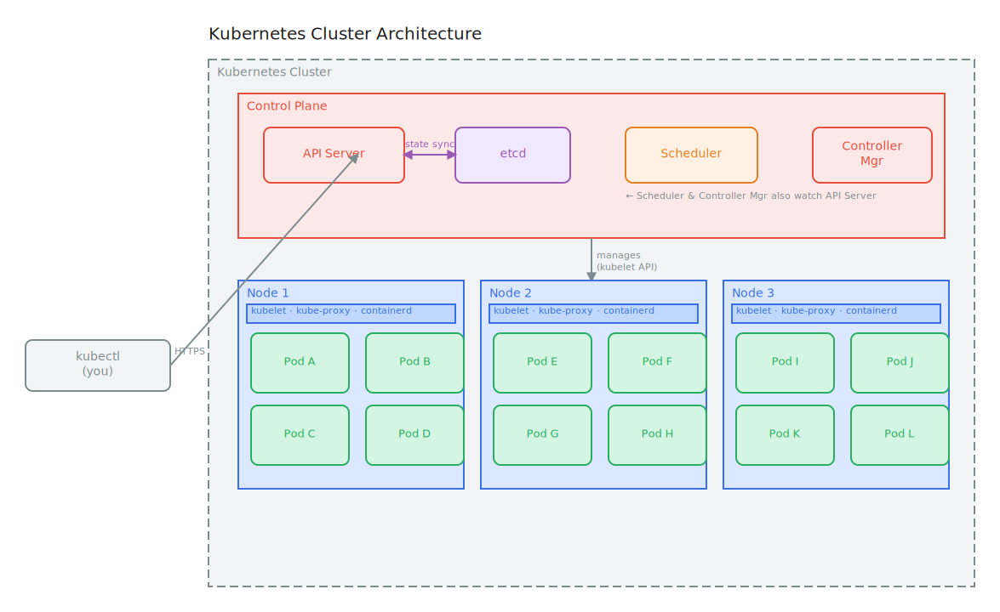

# Kubernetes Architecture

## What is it?

Kubernetes follows a **control plane / data plane** architecture. The control plane makes all decisions and maintains desired state. Worker nodes (data plane) are where actual workloads run. All components communicate via the Kubernetes API Server.

---

## In Simple Language

Kubernetes architecture is a **master-worker** setup:

- A small group of machines (control plane) run the "brain" components
- Many machines (worker nodes) do the actual work of running your containers
- All machines talk to each other through the API Server

---

## Real World Analogy

Kubernetes architecture is like a **city**:

| City Component | Kubernetes Equivalent |
|---------------|-----------------------|
| City Hall | Control Plane |
| Mayor's office | API Server |
| City records / archive | etcd |
| Urban planner | Scheduler |
| Department heads | Controllers |
| City districts | Worker Nodes |
| Apartments in each district | Pods |
| District supervisor | kubelet |
| Internal mail system | kube-proxy |

City Hall doesn't build anything itself. It plans, decides, and directs. The districts actually do the work. If a district has problems, City Hall reroutes work elsewhere.

---

## Why This Exists

This separation of concerns provides:
- **Resilience:** If a worker node fails, the control plane can reschedule its workloads to other nodes
- **Scalability:** Add more worker nodes without changing the control plane
- **Separation of responsibility:** Control plane focuses on decisions; nodes focus on execution
- **Security:** Workloads can't directly modify cluster state — all requests go through the API

---

## How It Works

**Control Plane components:**
- **API Server** — The central hub; all communication flows through it
- **etcd** — Distributed key-value store; the single source of truth for cluster state
- **Scheduler** — Watches for unscheduled pods and assigns them to nodes
- **Controller Manager** — Runs controllers that maintain desired state
- **Cloud Controller Manager** — Integrates with cloud provider APIs (optional)

**Worker Node components:**
- **kubelet** — Agent on each node; ensures containers run as specified
- **kube-proxy** — Handles network rules and routing on each node
- **Container Runtime** — Actually runs containers (containerd, CRI-O, etc.)

**Communication flow:**
```
You (kubectl) → API Server → etcd (store state)
                API Server → Scheduler (find a node)
                API Server → Controller Manager (maintain state)
                API Server → kubelet on Node (run containers)
```

---

## Visual Diagram



**Full Architecture:**
```
┌─────────────────────────────────────────────────────────────────┐
│                       Kubernetes Cluster                        │
│                                                                 │
│  ┌──────────────────────────────────────────────────────────┐   │
│  │                     Control Plane                        │   │
│  │                                                          │   │
│  │  ┌────────────────┐    ┌──────────────────────────────┐  │   │
│  │  │   API Server   │◄──►│  etcd (cluster state store)  │  │   │
│  │  └───────┬────────┘    └──────────────────────────────┘  │   │
│  │          │                                               │   │
│  │  ┌───────┴──────────────────────────┐                    │   │
│  │  │  Scheduler   │  Controller Mgr   │                    │   │
│  │  └──────────────────────────────────┘                    │   │
│  └──────────────────────┬───────────────────────────────────┘   │
│                         │ communicates via API                  │
│       ┌─────────────────┼─────────────────┐                     │
│       ▼                 ▼                 ▼                     │
│  ┌──────────┐      ┌──────────┐      ┌──────────┐               │
│  │  Node 1  │      │  Node 2  │      │  Node 3  │               │
│  │ kubelet  │      │ kubelet  │      │ kubelet  │               │
│  │kube-proxy│      │kube-proxy│      │kube-proxy│               │
│  │ runtime  │      │ runtime  │      │ runtime  │               │
│  │ [Pod][Pod│      │ [Pod][Pod│      │ [Pod][Pod│               │
│  └──────────┘      └──────────┘      └──────────┘               │
└─────────────────────────────────────────────────────────────────┘
         ▲
    [kubectl] ──► talks to API Server only
```

> **Excalidraw idea:** Aerial view of a city. City Hall (control plane) in the center with labeled rooms (API Server, etcd vault, Scheduler's planning room, Controller's office). Three districts (nodes) around it with apartment blocks (pods) inside. Roads (network) connecting everything. A messenger figure (kubectl) delivering requests to City Hall's front door.

---

## Key Terminologies

| Term | Technical Definition | Simple Explanation |
|------|---------------------|-------------------|
| **Control Plane** | Components that make cluster-level decisions | The brain and management layer |
| **Worker Node** | A machine that runs containerized workloads | A server doing the actual app work |
| **API Server** | RESTful interface; the central communication hub | The single front door to the cluster |
| **etcd** | Distributed key-value store for cluster state | The cluster's official record book |
| **Scheduler** | Assigns pods to nodes based on resource availability | The city planner finding a node home for each pod |
| **Controller Manager** | Runs control loops that maintain desired state | Department heads continuously checking their area |
| **kubelet** | Node agent that manages pod lifecycle on a node | The node's local supervisor |
| **kube-proxy** | Network proxy managing iptables rules on nodes | The node's internal post office routing traffic |
| **Container Runtime** | Software running containers (containerd, CRI-O) | The actual machine that runs your container |

---

## Common Misconceptions

- **"The control plane runs workloads"** — By default, control plane nodes only run system components. Your apps run on worker nodes.
- **"etcd is optional"** — etcd is critical. It's the source of truth. Losing etcd without a backup means losing all cluster state.
- **"All nodes are identical"** — Worker nodes can have different hardware (GPU nodes, high-memory nodes). The scheduler uses this to place workloads appropriately.
- **"kubectl talks to nodes directly"** — `kubectl` only talks to the API Server. The API Server then communicates with kubelets on nodes.

---

## Related Concepts

- [Control Plane Deep Dive](./control-plane.md)
- [Worker Node Deep Dive](./worker-node.md)
- [What is Kubernetes?](./what-is-kubernetes.md)
- [Pods](../02-core-objects/pods/README.md)

---

## Additional Learning Resources

- [Kubernetes Components — Official Docs](https://kubernetes.io/docs/concepts/overview/components/)
- [Kubernetes Architecture Explained — TechWorld with Nana](https://www.youtube.com/watch?v=umXEmn3cMVY)
- [CNCF Kubernetes Reference Architecture](https://www.cncf.io/blog/2019/03/21/a-guide-to-cloud-native-storage/)
