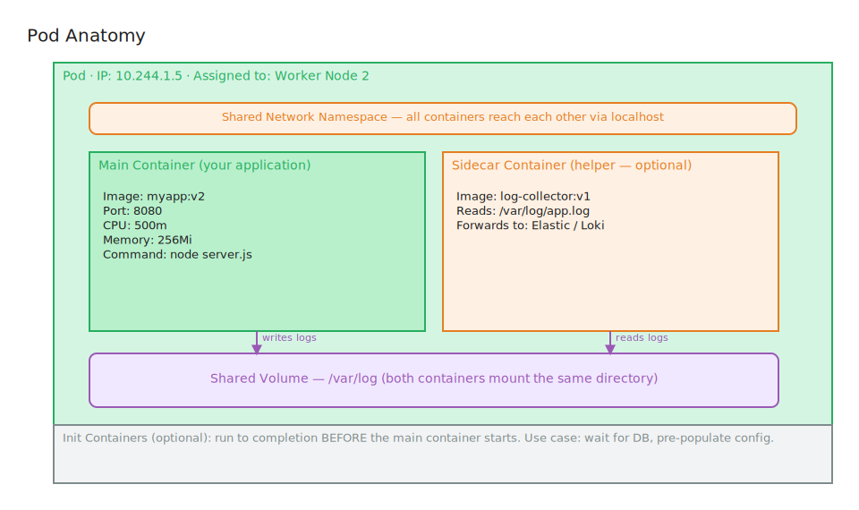

# Pods

## What is it?

A Pod is the smallest deployable unit in Kubernetes. It wraps one or more containers that share the same network namespace and storage volumes. All containers in a pod share the same IP address and communicate via localhost.

---

## In Simple Language

A Pod is a wrapper around your container (or containers).

Think of it as Kubernetes' way of saying "these containers belong together and should always run on the same machine, share the same network, and share the same storage."

You don't run containers directly in Kubernetes — you run pods. And pods run on nodes.

---

## Real World Analogy

A Pod is like a **shared apartment**:

- The **apartment** (pod) is the living unit — it has one address (IP), shared utilities (network, storage)
- **Roommates** (containers) live in the apartment together
- Each roommate has their own room (process, filesystem) but shares the address, WiFi (network), and kitchen (shared volumes)
- They can talk to each other through the internal intercom (localhost) without going outside

A pod with one container = a single person living in a studio apartment.
A pod with multiple containers = roommates — sidecar patterns (logging container, proxy container).

---

## Why This Exists

Kubernetes needed a unit of deployment that could:
- Group tightly coupled containers together (e.g., an app + its log collector)
- Guarantee those containers are always co-located on the same node
- Give them a shared network so they can communicate without any configuration
- Allow them to share file volumes easily

The Pod abstraction lets Kubernetes manage groups of containers as a single unit.

---

## How It Works

1. You define a Pod (via a manifest or a Deployment)
2. Kubernetes Scheduler assigns the Pod to a node
3. kubelet on that node starts the containers
4. An IP address is assigned to the Pod (not to individual containers)
5. All containers in the pod share that IP — they communicate via `localhost`
6. If any container crashes, kubelet restarts it (based on restart policy)
7. If the Pod is deleted/fails, it is **gone** — pods are ephemeral

**Pod lifecycle:**
```
Pending → Running → Succeeded/Failed
```
| Phase | Meaning |
|-------|---------|
| **Pending** | Accepted by K8s, not yet running (pulling image, waiting for node) |
| **Running** | At least one container is running |
| **Succeeded** | All containers exited successfully (exit code 0) |
| **Failed** | At least one container exited with a non-zero code |
| **Unknown** | Pod state cannot be determined |

---

## Visual Diagram



**Pod Internals:**
```
┌────────────────────────────────────────────────┐
│                    Pod                         │
│  IP: 10.244.1.5                                │
│                                                │
│  ┌───────────────────┐  ┌──────────────────┐   │
│  │  Main Container   │  │ Sidecar Container│   │
│  │  (your app)       │  │ (log collector)  │   │
│  │  port: 8080       │  │ reads shared logs│   │
│  └───────────────────┘  └──────────────────┘   │
│                                                │
│  Shared Volume: /var/log                       │
│  Shared Network: localhost                     │
└────────────────────────────────────────────────┘
         ▼ runs on ▼
         [ Worker Node ]
```

**Analogy Diagram:**
```
┌─────────────────────────────────────┐
│         Shared Apartment            │
│  Address: 42 Cluster Street         │
│                                     │
│  [Person A: Main Tenant (app)]      │
│  [Person B: Guest (sidecar logger)] │
│                                     │
│  Shared: WiFi, Mailbox, Kitchen     │
└─────────────────────────────────────┘
```

> **Excalidraw idea:** An apartment floor plan. The apartment door is labeled with the Pod's IP address. Inside: two rooms (containers) connected by an open corridor (localhost). A shared fridge (volume). A mailbox out front (single IP address accessible from outside). The building label shows the Node it's on.

---

## Key Terminologies

| Term | Technical Definition | Simple Explanation |
|------|---------------------|-------------------|
| **Pod** | Smallest deployable K8s unit; wraps one or more containers | The container's home in Kubernetes |
| **Container** | A running instance of a Docker/OCI image | The actual app process |
| **Pod IP** | A unique IP assigned to the pod (not per container) | The apartment's street address |
| **Sidecar** | A helper container in the same pod as the main app | A roommate doing a support task |
| **Init Container** | A container that runs to completion before the main containers start | The setup crew that prepares the apartment |
| **Volume** | Shared storage between containers in a pod | The shared kitchen between roommates |
| **Restart Policy** | Rules for when K8s restarts containers (Always, OnFailure, Never) | Instructions for what to do if a roommate leaves |
| **Ephemeral** | Temporary by nature — pods are replaced, not repaired | Apartments that get demolished and rebuilt, not renovated |

---

## Common Misconceptions

- **"Pods are permanent"** — Pods are ephemeral. When a pod dies, it gets replaced by a new one with a new IP. Never rely on a pod's IP directly.
- **"One pod = one container"** — Pods can contain multiple containers (sidecars, init containers), though one main container is the most common pattern.
- **"Pods restart themselves"** — Pods don't restart themselves. A controller (like a Deployment) replaces failed pods. A standalone pod that dies stays dead.
- **"You should create pods directly"** — In practice, you rarely create pods directly. Use Deployments or other higher-level objects. They manage pod lifecycle for you.

---

## Related Concepts

- [ReplicaSets](../replicasets/README.md) — Ensures the right number of identical pods run
- [Deployments](../deployments/README.md) — Manages pod lifecycle with updates and rollbacks
- [Services](../services/README.md) — Stable networking for ephemeral pods
- [Worker Nodes](../../01-kubernetes-introduction/worker-node.md) — Where pods run

---

## Additional Learning Resources

- [Pods — Official Docs](https://kubernetes.io/docs/concepts/workloads/pods/)
- [Pod Lifecycle](https://kubernetes.io/docs/concepts/workloads/pods/pod-lifecycle/)
- [Init Containers](https://kubernetes.io/docs/concepts/workloads/pods/init-containers/)
- [Sidecar Containers](https://kubernetes.io/docs/concepts/workloads/pods/sidecar-containers/)
