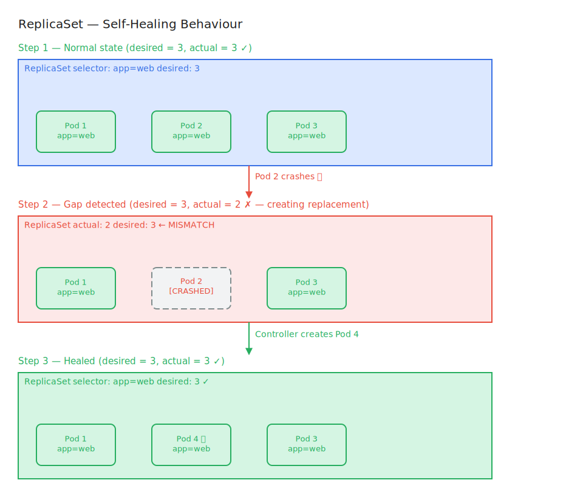

# ReplicaSets

## What is it?

A ReplicaSet is a Kubernetes controller that ensures a specified number of identical Pod replicas are running at all times. If a pod crashes or is deleted, the ReplicaSet creates a replacement. If there are too many pods, it removes the excess.

---

## In Simple Language

A ReplicaSet is the guardian that says: "I need exactly N copies of this pod running. Always."

If one dies, it creates a new one. If someone accidentally starts extra copies, it removes them. It constantly watches and corrects.

---

## Real World Analogy

A ReplicaSet is like a **franchise manager** responsible for a specific restaurant chain:

- The manager says: "We must always have 3 locations of BurgerShack open in this city"
- If one location closes (pod crashes), the manager immediately opens a new one
- If somehow 5 locations opened (too many pods), the manager closes the 2 extras
- Every location is identical — same menu, same layout, same brand (same pod template)

The manager doesn't care *which* 3 locations are open, just that there are always exactly 3.

---

## Why This Exists

Containers crash. Nodes fail. Pods are ephemeral.

Before controllers like ReplicaSet, if your app crashed at 3am, it stayed down until someone manually restarted it. ReplicaSets automate this:

- **Self-healing:** Crashed pods are replaced automatically
- **Availability:** N copies means the service survives individual pod failures
- **Consistency:** All replicas come from the same pod template — they're identical

---

## How It Works

1. You define a ReplicaSet with:
   - **replicas:** How many pods to maintain (e.g., 3)
   - **selector:** Which pods this ReplicaSet owns (via label matching)
   - **template:** The pod specification to create new pods from

2. The ReplicaSet controller (part of Controller Manager) runs a control loop:
   ```
   Watch for pods matching the selector
         │
         ▼
   Count matching pods
         │
   Too few? ──► Create pods from template
         │
   Too many? ──► Delete excess pods
         │
   Just right? ──► Do nothing, keep watching
   ```

3. This loop runs continuously — every time pods change, the ReplicaSet reacts.

**Label-based ownership:**
A ReplicaSet doesn't track pods by name — it tracks them by **label selectors**. Any pod with matching labels is considered owned by the ReplicaSet.

---

## Visual Diagram



**ReplicaSet maintaining 3 replicas:**
```
┌────────────────────────────────────────────────────┐
│                    ReplicaSet                      │
│         desired replicas: 3                        │
│         selector: app=web                          │
│                                                    │
│   ┌─────────┐   ┌─────────┐   ┌─────────┐          │
│   │  Pod 1  │   │  Pod 2  │   │  Pod 3  │          │
│   │ app=web │   │ app=web │   │ app=web │          │
│   └─────────┘   └─────────┘   └─────────┘          │
└────────────────────────────────────────────────────┘

         Pod 2 crashes
                ▼
┌────────────────────────────────────────────────────┐
│                    ReplicaSet                      │
│         actual: 2  desired: 3  ← GAP!              │
│   ┌─────────┐   [  GONE  ]    ┌─────────┐          │
│   │  Pod 1  │                 │  Pod 3  │          │
│   └─────────┘                 └─────────┘          │
│                ↓ creates                           │
│                ┌─────────┐                         │
│                │  Pod 4  │ ← new pod               │
│                │ app=web │                         │
│                └─────────┘                         │
└────────────────────────────────────────────────────┘
```

> **Excalidraw idea:** A franchise manager figure in the center with a scoreboard showing "Target: 3 / Actual: 3". One restaurant building grays out (crash). The scoreboard shows "Target: 3 / Actual: 2". An arrow shows the manager immediately deploying a new building. Scoreboard returns to 3/3.

---

## Key Terminologies

| Term | Technical Definition | Simple Explanation |
|------|---------------------|-------------------|
| **ReplicaSet** | Controller maintaining a stable count of pod replicas | The guardian ensuring N pods always run |
| **Replicas** | The desired number of pod copies to maintain | How many copies of the pod should exist |
| **Pod Template** | The spec used to create new pods | The blueprint for any pod the RS creates |
| **Selector** | Label query used to identify owned pods | The name tag the RS uses to recognize its pods |
| **Control Loop** | Continuous watch-compare-act cycle | The RS's never-ending "count and correct" routine |
| **Self-Healing** | Auto-recovery from pod failures | New pods replace crashed ones automatically |

---

## Common Misconceptions

- **"I should create ReplicaSets directly"** — In practice, use **Deployments**. Deployments manage ReplicaSets and add update/rollback capabilities.
- **"ReplicaSets restart crashed containers"** — ReplicaSets replace dead pods (create new ones). The kubelet handles container restarts within a pod.
- **"ReplicaSet pods are the same as the original"** — They're created from the same template but are fresh pod instances with new IPs.
- **"A ReplicaSet with replicas=1 provides HA"** — One replica means one pod. If it fails, there's a brief downtime while the replacement starts. For true HA, use replicas ≥ 2.

---

## Related Concepts

- [Pods](../pods/README.md) — What ReplicaSets manage
- [Deployments](../deployments/README.md) — Manages ReplicaSets; what you should actually use
- [Labels & Selectors](../labels-selectors/README.md) — How ReplicaSets identify their pods

---

## Additional Learning Resources

- [ReplicaSet — Official Docs](https://kubernetes.io/docs/concepts/workloads/controllers/replicaset/)
- [Controllers — Official Docs](https://kubernetes.io/docs/concepts/architecture/controller/)
